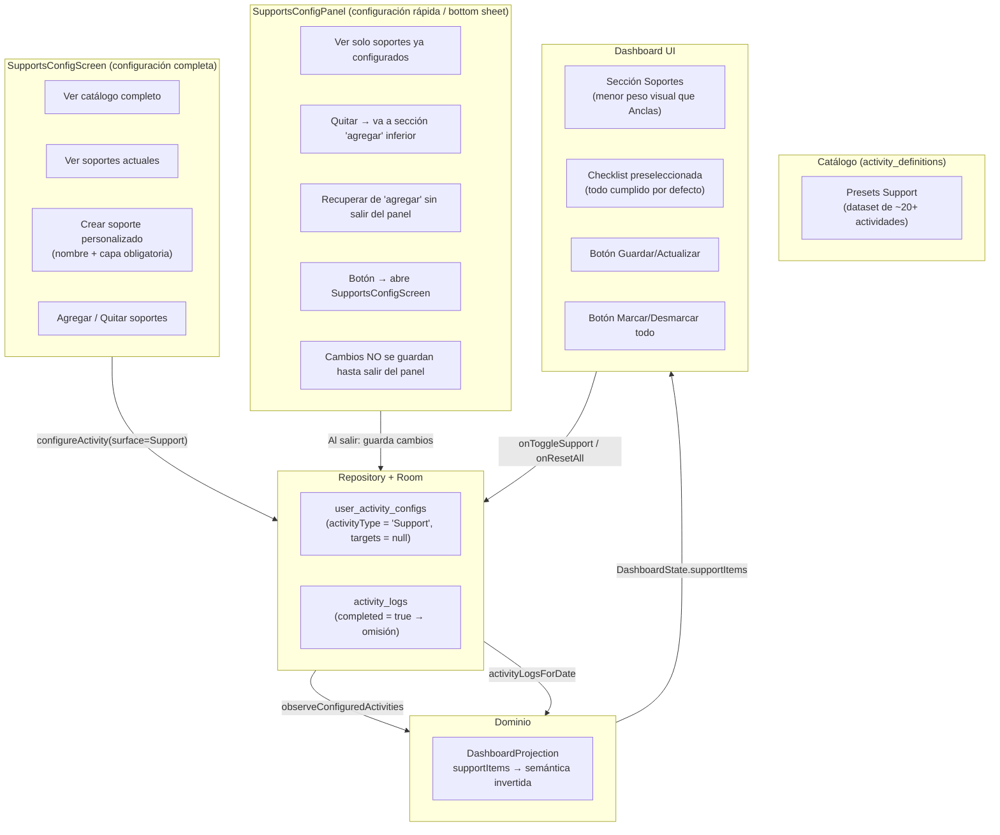

# Definición y plan de reestructuración — Soporte

Fecha: 2026-05-25
Proyecto: Vocal / Autonomía sin límites
Scope: Reestructuración completa del feature Soporte (configuración, dominio, dashboard)

Fuentes:
- `docs/configuracion-canonica-sistema-v1.md` §2
- `docs/nucleo-dominio-autonomia.md` §Soportes
- `docs/presets-actividades-v1.md` §Soportes
- `docs/definicion-tablas-room-v1.md`
- `docs/plan-maestro-roadmap.md` §2 (S1-S4)
- Definiciones de UX del producto (2026-05-25)

---

## 1. Definición canónica

### 1.1 Qué es Soporte

```
Acción de mantenimiento diario que sostiene dignidad y estructura.
Complementa las anclas, no compite con ellas.
```

### 1.2 Reglas de dominio

| Regla | Detalle |
|-------|---------|
| Sin targets | No tiene meta semanal, tiempo por sesión ni duración de compromiso |
| Capa obligatoria | Todo soporte pertenece exactamente a una capa (Interior, Cuerpo, Conducta, Vínculos, Proyecto) |
| UX inversa | Sistema asume todo cumplido. Usuario solo desmarca lo que NO hizo |
| Sin límite | El usuario configura los que necesite |
| Catálogo de presets | Dataset de actividades predefinidas de tipo soporte |
| Custom permitido | Usuario puede crear soportes personalizados (nombre + capa obligatoria) |

### 1.3 Principio de cero fricción

```
Tener una checklist diaria de cosas como cepillarse o tender la cama es molesto.
El sistema asume que el usuario ya las completó.
Solo registra omisiones.
```

### 1.4 Lo que NO es un Soporte

- Una práctica cultivable (eso es un Ancla)
- Un pendiente puntual (eso es un Task)
- Una regla o restricción ("no usar celular en cama")
- Un hábito con objetivos de mejora

---

## 2. Arquitectura — Principio rector

```
CONFIGURACIÓN (valida) → DOMINIO (calcula) → DASHBOARD (presenta)
```

Para Soporte, esto se traduce en:

| Capa | Rol | Reglas |
|------|-----|--------|
| **Configuración** | Validar antes de guardar | Capa obligatoria, sin targets, el tipo es Support |
| **Dominio** | Calcular soportes con semántica invertida | Si no hay log del día → cumplido. Solo los configurados por el usuario entran al dominio |
| **Dashboard** | Presentar con menor peso visual que Anclas | Checklist preseleccionada, botones guardar/marcar todo |

### 2.1 Independencia de features

Cada feature del dominio (Ancla, Soporte, Task, Sueño, Sobriedad) tiene su **propio núcleo de configuración independiente**. No comparten lógica de configuración entre sí porque:

- Tienen reglas de validación distintas
- Tienen modelos de datos distintos (targets obligatorios vs sin targets)
- Tienen UX distinta (normal vs inversa)

La independencia se aplica en:
- Pantallas de configuración separadas
- Validación propia por feature
- Flujos de datos independientes (aunque compartan Room y repositorio como infraestructura)

---

## 3. Flujo de datos esperado



---

## 4. UX/UI esperada

### 4.1 SupportsConfigScreen (configuración completa)

**Ruta**: drawer → "Soportes" → pantalla completa

**Contenido**:

1. **TopBar**: título "Soportes", botón volver
2. **Filtro por capas**: chips o pestañas horizontales para filtrar por capa (Interior, Cuerpo, Conducta, Vínculos, Proyecto). Mismo patrón que `AnchorConfigScreen`. Al seleccionar una capa, el catálogo y "Mis soportes" se filtran a esa capa
3. **Sección "Mis soportes"**: lista de soportes ya configurados (filtrados por capa seleccionada), cada uno con botón "Quitar"
4. **Sección "Catálogo"**: lista de actividades de soporte disponibles del dataset (filtradas por capa seleccionada). Las ya configuradas no aparecen. Cada una con botón "Agregar"
5. **Botón "+ Crear soporte personalizado"**: diálogo con campo nombre + selector de capa (obligatorio, con la capa del filtro actual preseleccionada). Sin campos de tiempo/frecuencia
6. **Comportamiento**: al agregar del catálogo, la actividad desaparece del catálogo y aparece en "Mis soportes"

**Dataset de soportes**: será provisto en documento separado (en creación paralela). Se esperan ~20+ actividades de soporte con capa asignada.

### 4.2 SupportsConfigPanel (configuración rápida — bottom sheet)

**Ruta**: dashboard → menú configuración rápida → Soportes → bottom sheet

**Contenido**:

1. **Header**: "Soportes" con botón cerrar (X)
2. **Lista de soportes configurados**: cada uno con toggle para quitar
3. **Sección inferior "Agregar soporte"**: aquí caen los soportes que el usuario quitó arriba. Puede re-agregarlos sin salir del panel
4. **Botón "Ver catálogo completo"**: redirige a `SupportsConfigScreen` (pantalla completa)
5. **Comportamiento**:
   - Los cambios NO se persisten hasta que el usuario cierra el panel
   - Al cerrar: se guardan las eliminaciones, se ignoran los re-agregados (vuelven a su estado)
   - Si el usuario quitó algo por error, lo recupera desde "Agregar soporte" dentro del mismo panel

### 4.3 Dashboard — Sección Soportes

**Principio**: menor peso visual que Anclas. No compiten.

**Estado actual (problema)**: `SupportsPreviewSection` tiene el mismo peso visual que `AnchorPreviewSection`. Esto contradice la jerarquía del dominio donde Anclas > Soportes.

**Estado deseado**:

1. **Presentación colapsada por defecto**: un botón o sección compacta que dice "Soportes — X/X hoy" con un ícono sutil
2. **Al expandir**: checklist de todos los soportes del día, todos preseleccionados como cumplidos (checkbox sin marcar = hecho)
3. **Interacción**:
   - Usuario desmarca los que NO hizo (checkbox se marca en color ámbar/marrón = omisión)
   - Puede volver a marcar si se equivocó
4. **Botones de acción**:
   - **"Guardar"**: persiste el estado actual de la checklist como registro del día
   - **"Marcar/Desmarcar todo"**: toggle rápido para marcar todas las omisiones o restaurar todo como cumplido
5. **Momento de uso**: idealmente el usuario revisa esto antes de dormir. No es interacción frecuente durante el día
6. **Visual**:
   - Tipografía más pequeña que Anclas
   - Colores más sutiles (textMuted, amber en vez de coral)
   - Sin animaciones llamativas
   - Altura reducida de items

---

## 5. Auditoría — Estado actual vs esperado

### 5.1 Lo que ya funciona

| Aspecto | Archivo | Estado |
|---------|---------|--------|
| Semántica invertida (no log = cumplido) | `DashboardProjection.kt:208-218` | ✅ |
| Inicialización diaria | `DashboardProjection.kt:53-56` | ✅ |
| Navegación dashboard → config | `MainActivity.kt:57-59` | ✅ |
| Navegación drawer → config | `NavigationDrawer` | ✅ |
| `onResetAll` funcional | `DashboardViewModel.kt:325-337` | ✅ |
| `onToggleSupport` con semántica invertida | `DashboardViewModel.kt:309-323` | ✅ |
| Flujo add/remove/create en config | `SupportsConfigScreen.kt` | ✅ |
| `isInverted` afecta color del checkbox | `CheckItem.kt:138-140` | ✅ |

### 5.2 Lo que está roto o falta

| ID | Problema | Archivo:Línea | Severidad |
|----|----------|---------------|-----------|
| **A1** | Solo 7 de 8 presets actuales; `act_dormir_temprano` tiene `presetCategory = "anchor"` | `DefaultSeeds.kt:145` | Alta |
| **A2** | Dataset de soportes insuficiente: solo 8 actividades | `DefaultSeeds.kt:142-167` | Alta |
| **A3** | SupportsPreviewSection tiene mismo peso visual que AnchorPreviewSection | `DashboardScreen.kt` + `SupportsPreviewSection.kt` | Alta |
| **A4** | Validación ausente en addToSupports: no verifica capa, no verifica duplicados | `AutonomiaRepository.kt:339-346` | Media |
| **A5** | UI duplicada: SupportsConfigScreen vs SupportsConfigPanel | `SupportsConfigScreen.kt` + `DashboardPanels.kt:1003-1034` | Media |
| **A6** | SupportsConfigPanel no tiene deferred save ni sección "agregar" de recuperación | `DashboardPanels.kt:1003-1034` | Alta |
| **A7** | SupportsConfigPanel no tiene botón para redirigir a SupportsConfigScreen | `DashboardPanels.kt:1003-1034` | Media |
| **A8** | Dashboard no tiene botón Guardar ni botón Marcar/Desmarcar todo para soportes | `SupportsPreviewSection.kt` | Alta |
| **A9** | `isSupport()` en ActivityPolicy filtra también goals (`!isGoal()`) | `ActivityPolicy.kt:13-14` | Baja |
| **A10** | `displaySurface` deprecated sigue en modelo de dominio | `ActivityDefinition.kt:21` | Baja |
| **A11** | Falta botón "Ver catálogo completo" en SupportsConfigPanel | `DashboardPanels.kt` | Media |
| **A12** | Falta filtro por capas en SupportsConfigScreen | `SupportsConfigScreen.kt` | Alta |

### 5.3 Cumplimiento de arquitectura

```
CONFIGURACIÓN (valida) → DOMINIO (calcula) → DASHBOARD (presenta)
```

| Capa | Estado actual | Estado esperado |
|------|---------------|-----------------|
| **Configuración** | Passthrough sin validación | Debe validar: capa obligatoria, sin targets, tipo Support |
| **Dominio** | Calcula correctamente la semántica invertida | ✅ Sin cambios mayores |
| **Dashboard** | Mismo peso visual que Anclas | Debe ser visualmente secundario, colapsable, con botones guardar/toggle |

---

## 6. Plan de reestructuración

### Fase 1 — CONFIGURACIÓN (validar y completar)

**Objetivo**: la capa de configuración debe ser la guardiana que valida antes de que los datos lleguen al dominio.

#### 1.1 Corregir seeds del catálogo de soportes

| Tarea | Archivo | Cambio |
|-------|---------|--------|
| F1.1 | `DefaultSeeds.kt:143-145` | Corregir `act_dormir_temprano`: `presetCategory = "support"`, `sortOrder` en rango de soportes |
| F1.2 | `DefaultSeeds.kt:142-167` | (Pendiente) Incorporar nuevo dataset de soportes cuando esté disponible (~20+ actividades) |

**Dependencia**: el dataset extendido está siendo creado en paralelo. Se incorporará cuando esté listo.

#### 1.2 Agregar validación en el repositorio

| Tarea | Archivo | Cambio |
|-------|---------|--------|
| F1.3 | `AutonomiaRepository.kt` | Agregar `addSupport(activityId, layerId)`: validar que la actividad existe, que la capa es válida, que no está duplicada, y que targets quedan null |
| F1.4 | `AutonomiaRepository.kt` | Agregar `removeSupport(activityId)`: validar que está configurada como Support antes de eliminar |

**Regla**: "Lo que se guarda en la BD ya pasó todas las reglas."

#### 1.3 Separar SupportsConfigPanel del dashboard panels

| Tarea | Archivo | Cambio |
|-------|---------|--------|
| F1.5 | Nuevo: `ui/supports/SupportsConfigPanel.kt` | Extraer SupportsConfigPanel de `DashboardPanels.kt` a su propio archivo |
| F1.6 | `DashboardPanels.kt` | Eliminar SupportsConfigPanel del archivo, dejar solo la referencia |

#### 1.4 Agregar filtro por capas en SupportsConfigScreen

| Tarea | Archivo | Cambio |
|-------|---------|--------|
| F1.7 | `SupportsConfigScreen.kt` | Implementar chips/pestañas de filtro por capa (Interior, Cuerpo, Conducta, Vínculos, Proyecto). Mismo patrón visual que `AnchorConfigScreen` |
| F1.8 | `SupportsConfigScreen.kt` | Filtrar "Mis soportes" y "Catálogo" según la capa seleccionada |
| F1.9 | `SupportsConfigScreen.kt` | En "Crear soporte personalizado", preseleccionar la capa del filtro activo |

#### 1.5 Implementar deferred save en SupportsConfigPanel

| Tarea | Archivo | Cambio |
|-------|---------|--------|
| F1.10 | `SupportsConfigPanel.kt` | Manejar estado local (no persistir hasta salir): lista de "quitados" + sección "agregar" inferior para recuperar |
| F1.11 | `SupportsConfigPanel.kt` | Al cerrar el panel: persistir solo los soportes que el usuario dejó como quitados |
| F1.12 | `SupportsConfigPanel.kt` | Agregar botón "Ver catálogo completo" que redirige a `SupportsConfigScreen` |

### Fase 2 — DOMINIO (limpiar y alinear)

**Objetivo**: el dominio debe calcular correctamente sin dead code ni filtros incorrectos.

#### 2.1 Corregir ActivityPolicy

| Tarea | Archivo | Cambio |
|-------|---------|--------|
| F2.1 | `ActivityPolicy.kt:13-14` | `isSupport()` debe ser `activityType == ActivitySurface.Support` (sin `!isGoal()`) |

#### 2.2 Limpiar modelo de dominio

| Tarea | Archivo | Cambio |
|-------|---------|--------|
| F2.2 | `ActivityDefinition.kt:21` | Remover `displaySurface` deprecated si ya no tiene consumidores |
| F2.3 | `DashboardState.kt` | Verificar que `DashboardCheckItemState` tiene todos los campos necesarios para soportes con semántica invertida |

### Fase 3 — DASHBOARD (presentar con jerarquía correcta)

**Objetivo**: la sección de soportes en el dashboard debe tener menor peso visual que anclas y ofrecer los controles adecuados.

#### 3.1 Rediseñar sección de soportes en dashboard

| Tarea | Archivo | Cambio |
|-------|---------|--------|
| F3.1 | `SupportsPreviewSection.kt` | Reducir jerarquía visual: tipografía más pequeña, colores más sutiles, altura reducida |
| F3.2 | `SupportsPreviewSection.kt` | Implementar estado colapsado por defecto: botón compacto "Soportes — X/X hoy" |
| F3.3 | `SupportsPreviewSection.kt` | Al expandir: mostrar checklist con todos los soportes preseleccionados |

#### 3.2 Implementar botones de acción en dashboard

| Tarea | Archivo | Cambio |
|-------|---------|--------|
| F3.4 | `SupportsPreviewSection.kt` | Agregar botón "Guardar" que persiste el estado actual de la checklist |
| F3.5 | `SupportsPreviewSection.kt` | Agregar botón "Marcar/Desmarcar todo" como toggle rápido |
| F3.6 | `DashboardViewModel.kt` | Implementar `saveSupportChecklist()` y `toggleAllSupports()` |

#### 3.3 Conectar dashboard con configuración

| Tarea | Archivo | Cambio |
|-------|---------|--------|
| F3.7 | `DashboardScreen.kt` | Asegurar que el link "editar soportes" abre `SupportsConfigScreen` |
| F3.8 | `DashboardScreen.kt` | Asegurar que el menú de configuración rápida abre el nuevo `SupportsConfigPanel` |

---

## 7. Orden de ejecución

```
Fase 1 (Configuración) → Fase 2 (Dominio) → Fase 3 (Dashboard)
```

Cada fase se verifica antes de pasar a la siguiente. El orden es forzoso porque:
- Sin Fase 1, los datos que llegan al dominio no están validados
- Sin Fase 2, el dominio tiene dead code y filtros incorrectos
- Sin Fase 3, la UI no refleja la jerarquía correcta del dominio

### Dependencias externas

| Dependencia | Estado | Impacto |
|-------------|--------|---------|
| Dataset extendido de soportes | En creación (paralelo) | Bloquea F1.2 |
| `act_dormir_temprano` bugfix | Sin dependencia | Se puede hacer ya |

---

## 8. Archivos del plan

| Archivo | Fase | Tipo de cambio |
|---------|------|----------------|
| `DefaultSeeds.kt` | F1.1 | Corregir presetCategory |
| `AutonomiaRepository.kt` | F1.2 | Agregar validación |
| `SupportsConfigPanel.kt` (nuevo) | F1.3, F1.5 | Crear + deferred save + redirigir |
| `DashboardPanels.kt` | F1.3 | Quitar SupportsConfigPanel |
| `SupportsConfigScreen.kt` | F1.4 | Agregar filtro por capas |
| `ActivityPolicy.kt` | F2.1 | Corregir isSupport() |
| `ActivityDefinition.kt` | F2.2 | Remover displaySurface |
| `DashboardState.kt` | F2.3 | Verificar modelo |
| `SupportsPreviewSection.kt` | F3.1-3.5 | Rediseño completo de UX |
| `DashboardViewModel.kt` | F3.6 | Nuevos métodos |
| `DashboardScreen.kt` | F3.7-3.8 | Verificar conexiones |

---

## 9. Notas para implementación

- **No tocar Anchor**: este plan es exclusivo de Soporte. Las anclas tienen su propio núcleo de configuración independiente.
- **Respetar la tríada**: configuración valida → dominio calcula → dashboard presenta.
- **Principio de cero fricción**: todo cumplido por defecto, solo se registran omisiones.
- **Tono**: sin culpa, sin diagnóstico. "Hoy no hiciste X" es información, no castigo.
- **Dataset**: cuando llegue el dataset extendido, se incorpora en F1.2 sin cambiar la arquitectura.
