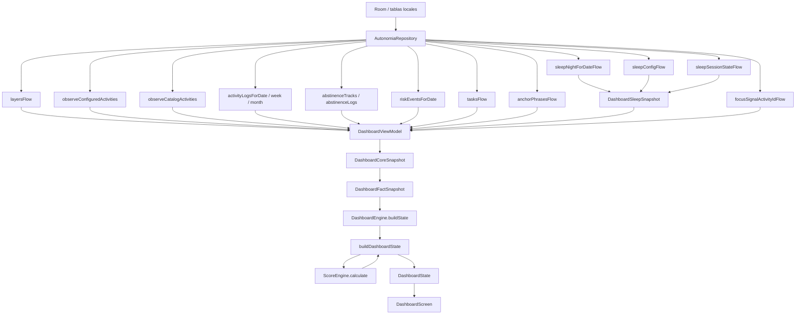
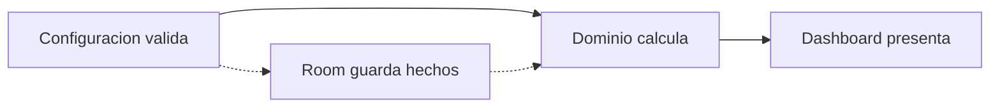
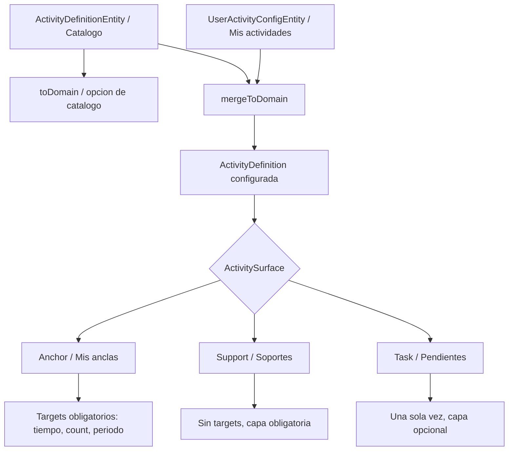
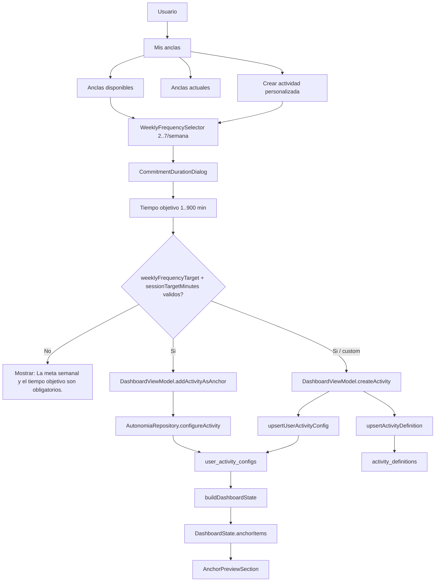
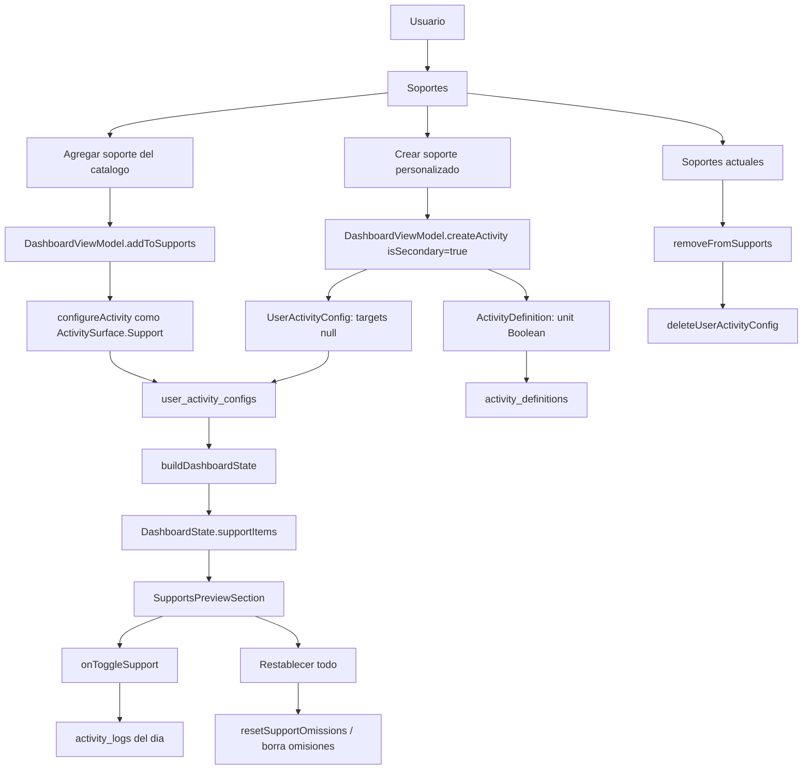
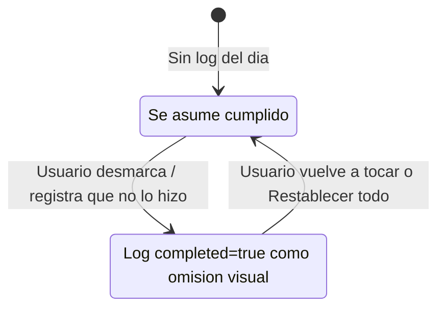
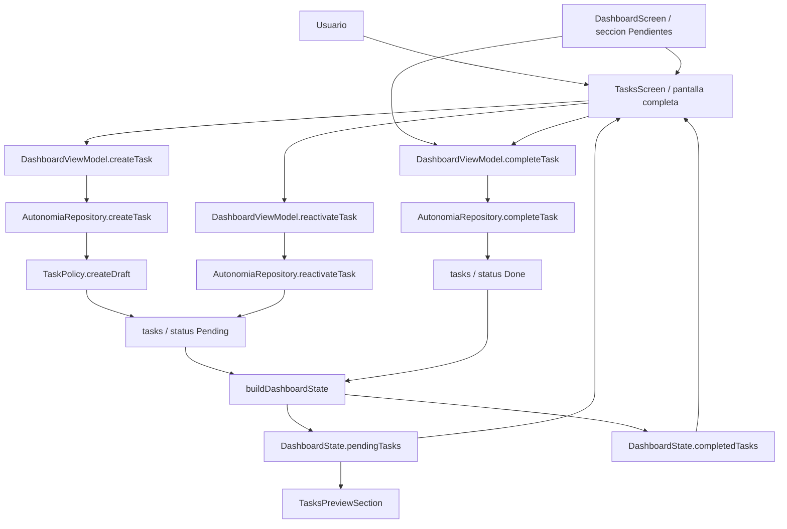
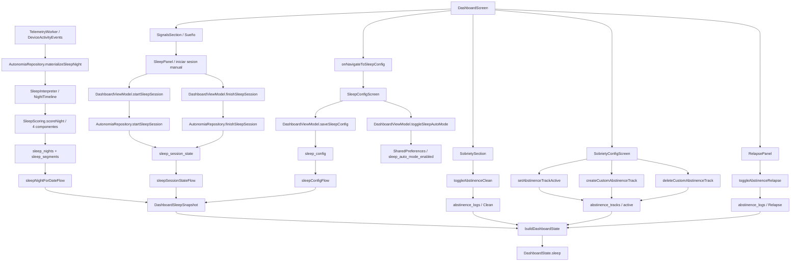

# Mapa de flujos del proyecto — estado actual

> **Estado: vivo** — se actualiza cuando cambia el codigo que describe.

Fecha: 2026-05-24
Proyecto: Autonomía sin límites
Proposito: dejar una referencia visual clara de como fluye la app despues de la
reestructuracion de dashboard Fases 1-3.

Este documento describe el estado implementado a dia de hoy. No reemplaza a los
documentos canonicos de dominio; sirve como mapa de lectura para ubicarse rapido
en el codigo.

---

## 1. Mapa general

```mermaid
flowchart TD
    Usuario["Usuario"] --> MainActivity["MainActivity"]
    MainActivity --> DashboardScreen["DashboardScreen"]
    MainActivity --> ScoringScreen["ScoringScreen / Estado Base"]
    MainActivity --> AnchorConfigScreen["AnchorConfigScreen / Mis anclas"]
    MainActivity --> SupportsConfigScreen["SupportsConfigScreen / Soportes"]
    MainActivity --> TasksScreen["TasksScreen / Pendientes"]
    MainActivity --> SobrietyConfigScreen["SobrietyConfigScreen / Sobriedad"]
    MainActivity --> SleepConfigScreen["SleepConfigScreen / Sueño"]

    DashboardScreen --> DashboardSheetHost["DashboardSheetHost / paneles inferiores"]
    DashboardScreen --> NavigationDrawer["NavigationDrawer / menu lateral"]

    DashboardScreen --> AnchorPreview["AnchorPreviewSection / Mis anclas"]
    DashboardScreen --> SupportsPreview["SupportsPreviewSection / Soportes"]
    DashboardScreen --> TasksPreview["TasksPreviewSection / Pendientes"]
    DashboardScreen --> SobrietySection["SobrietySection / Sobriedad"]
    DashboardScreen --> WeekSection["WeekSection / semana"]

    NavigationDrawer --> AnchorConfigScreen
    NavigationDrawer --> SupportsConfigScreen
    NavigationDrawer --> TasksScreen
    NavigationDrawer --> SobrietyConfigScreen
    NavigationDrawer --> SleepConfigScreen

    DashboardSheetHost --> EntryMenu["EntryMenuPanel"]
    DashboardSheetHost --> AnchorPanel["AnchorPanel / registrar ancla"]
    DashboardSheetHost --> SupportPanel["AnchorPanel usado como soporte"]
    DashboardSheetHost --> SleepPanel["SleepPanel"]
    DashboardSheetHost --> ActivitySettingsPanel["ActivitySettingsPanel"]
    DashboardSheetHost --> RelapsePanel
```

### Lectura rapida

- La pantalla inicial real es `DashboardScreen`.
- `MainActivity` cambia entre pantallas completas: Dashboard, Scoring, Mis anclas,
  Soportes, Pendientes, Sobriedad y SleepConfig. El enum `AppScreen` lista los 7 valores.
- El dashboard tambien abre paneles inferiores para registro rapido.
- `ScoringScreen` muestra el detalle del score semanal ("Estado Base").
- `SleepConfigScreen` configura la ventana objetivo de sueño y el modo automatico.
- `SobrietyConfigScreen` gestiona presets opt-in y rachas personalizadas.

---

## 2. Flujo de datos del dashboard

### Regla estructural

- La configuracion decide que se puede guardar.
- Room conserva hechos y configuracion local.
- El dominio interpreta esos hechos.
- Compose no decide reglas del dominio; pinta `DashboardState` y emite acciones.

---

## 3. Modelo de actividades

### Estado actual de cada superficie

| Superficie | Configuracion | Registro diario | Dashboard |
|------------|---------------|-----------------|-----------|
| Mis anclas | `AnchorConfigScreen` valida target obligatorio | `toggleActivity` / `saveActivityValue` | `AnchorPreviewSection` |
| Soportes | `SupportsConfigScreen` agrega catalogo o custom sin targets | `onToggleSupport` usa semantica invertida | `SupportsPreviewSection` |
| Pendientes | `TasksScreen` crea y revive tareas | `completeTask` marca Done | `TasksPreviewSection` muestra solo abiertos |

---

## 4. Flujo de Mis anclas

### Reglas vigentes

- Una ancla nueva siempre tiene `weeklyFrequencyTarget` obligatorio entre 2 y 7.
- Una ancla nueva siempre tiene `sessionTargetMinutes` obligatorio entre 1 y 900.
- `commitmentDurationMonths = null` representa **Indefinido** y es una configuracion valida.
- La frecuencia mensual ya no existe en la UI de anclas; `TargetPeriod.Month` queda solo como compatibilidad legacy.
- Las anclas aparecen todos los dias en `anchorItems`, aunque su meta sea semanal.

---

## 5. Flujo de Soportes

### Semantica invertida

- Soportes no tienen targets.
- El sistema asume todo cumplido por defecto.
- El usuario marca solo lo que no hizo.
- `Restablecer todo` limpia las omisiones del dia.

---

## 6. Flujo de Pendientes

### Regla vigente

- Solo se muestran en dashboard las tareas con `TaskStatus.Pending`.
- Completar una tarea la saca de `pendingTasks` y la mueve a `completedTasks`.
- Revivir una tarea completada la vuelve `Pending`.
- La capa es opcional; sin capa queda `ContributionRole.Neutral`, con capa queda `ContributionRole.Support`.
- Pendientes no aparece en Configuracion rapida; no configura una base recurrente.

---

## 7. Flujo de Sueño y Sobriedad

### Estado vigente

- **Sueño v2**: la tabla `sleep_logs` fue dropeada en MIGRATION_11_12. El modelo
  actual usa `sleep_nights` (una noche) + `sleep_segments` (segmentos de la noche).
  `sleepLogForDate` es un stub `flowOf(null)` marcado `@Deprecated` (TODO WU-6);
  el flow real es `sleepNightForDateFlow`.
- El modo automatico (`toggleSleepAutoMode`) usa `DeviceActivityEventEntity`
  capturada por telemetria. `SleepInterpreter` convierte esos eventos en una
  `NightTimeline`; `SleepScoring` la puntua con 4 componentes: duracion 0.40,
  continuidad 0.25, alineacion 0.20, interrupcion digital 0.15.
- El modo manual (session start/finish) coexiste con el automatico.
- `SleepConfigScreen` es una pantalla completa propia (no un panel inferior);
  configura la ventana objetivo y el toggle de modo automatico.
- Sobriedad aparece en el dashboard si hay rachas activas y permite marcar limpio.
- `SobrietyConfigScreen` activa/desactiva presets opt-in y gestiona personalizadas.
- Recaidas se registran desde el panel inferior para rachas activas.

---

## 8. Salida de `DashboardState`

```mermaid
flowchart TD
    Projection["buildDashboardState"] --> Status["status / score y texto"]
    Projection --> DailyProgress["dailyProgress"]
    Projection --> AnchorPhrase["anchorPhrase"]
    Projection --> Layers["layers"]
    Projection --> Signals["signals"]
    Projection --> SobrietyTracks["sobrietyTracks"]
    Projection --> SobrietyOptions["sobrietyOptions"]
    Projection --> AnchorItems["anchorItems"]
    Projection --> SupportItems["supportItems"]
    Projection --> PendingTasks["pendingTasks"]
    Projection --> CompletedTasks["completedTasks"]
    Projection --> WeekRows["weekRows"]
    Projection --> Dimensions["dimensions"]
    Projection --> Sleep["sleep"]
    Projection --> ActivityOptions["activityOptions"]

    AnchorItems --> AnchorPreview["AnchorPreviewSection"]
    SupportItems --> SupportsPreview["SupportsPreviewSection"]
    SobrietyTracks --> SobrietyPreview["SobrietySection"]
    SobrietyOptions --> SobrietyConfigScreen["SobrietyConfigScreen"]
    PendingTasks --> TasksPreview["TasksPreviewSection"]
    PendingTasks --> TasksScreen["TasksScreen"]
    CompletedTasks --> TasksScreen
    WeekRows --> WeekSection["WeekSection"]
    ActivityOptions --> ConfigScreens["Mis anclas / Soportes / paneles"]
```

### Orden visual actual del dashboard

1. TopBar
2. StatusCard
3. DailyProgressCard
4. AnchorPhraseCard
5. ActionButtons
6. LayersSection
7. SignalsSection
8. SobrietySection
9. AnchorPreviewSection
10. SupportsPreviewSection
11. TasksPreviewSection
12. WeekSection

---

## 9. Puntos de entrada por archivo

| Area | Archivo principal | Rol |
|------|-------------------|-----|
| Navegacion de pantallas | `app/src/main/java/dev/panopt/autonomia/MainActivity.kt` | Cambia entre las 7 pantallas del enum `AppScreen` |
| Estado de UI | `app/src/main/java/dev/panopt/autonomia/ui/dashboard/DashboardViewModel.kt` | Combina flujos, recibe acciones y escribe en repositorio |
| Persistencia | `app/src/main/java/dev/panopt/autonomia/AutonomiaRepository.kt` | Fachada sobre Room, seeds y preferencias |
| Dominio dashboard | `app/src/main/java/dev/panopt/autonomia/domain/dashboard/DashboardProjection.kt` | Construye `DashboardState` |
| Modelo de estado | `app/src/main/java/dev/panopt/autonomia/domain/dashboard/DashboardState.kt` | DTOs consumidos por Compose |
| Scoring | `app/src/main/java/dev/panopt/autonomia/ui/scoring/ScoringScreen.kt` | Detalle del score semanal ("Estado Base") |
| Sueño config | `app/src/main/java/dev/panopt/autonomia/ui/sleep/SleepConfigScreen.kt` | Configura ventana objetivo y modo automatico de sueño |
| Sueño dominio | `app/src/main/java/dev/panopt/autonomia/domain/sleep/interpretation/` | `SleepInterpreter` + scoring de 4 componentes |
| Anclas | `app/src/main/java/dev/panopt/autonomia/ui/anchors/AnchorConfigScreen.kt` | Configuracion completa de Mis anclas |
| Soportes | `app/src/main/java/dev/panopt/autonomia/ui/supports/SupportsConfigScreen.kt` | Configuracion de Soportes |
| Pendientes | `app/src/main/java/dev/panopt/autonomia/ui/tasks/TasksScreen.kt` | Pantalla completa de Pendientes |
| Sobriedad | `app/src/main/java/dev/panopt/autonomia/ui/sobriety/SobrietyConfigScreen.kt` | Pantalla completa de Sobriedad |
| Componentes dashboard | `app/src/main/java/dev/panopt/autonomia/ui/dashboard/components/` | Secciones visuales del dashboard |
