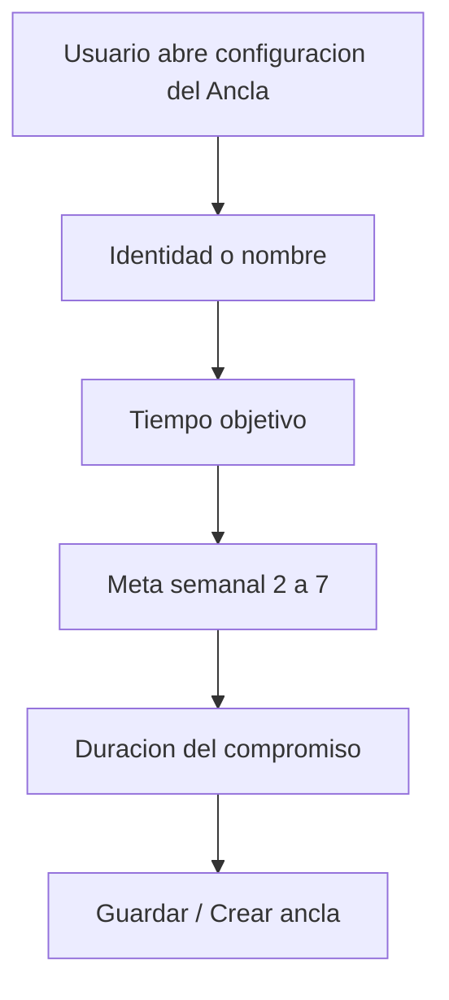

# Propuesta de Rediseño de Anclas: Metas, Duración de Compromiso y Flujo UX

Este documento detalla el plan técnico, las implicaciones del motor de scoring, la persistencia en base de datos y el flujo de interfaz de usuario (UX) para el refactor de la configuración de anclas en **Vocal**.

> Estado 2026-05-25: la parte de dominio/persistencia sigue siendo referencia
> util. El flujo UX final quedo canonizado en
> `docs/mis-anclas-ux-canon-v1.md`, que manda sobre cualquier diferencia en
> este documento.

---

## 1. Mapeo en Base de Datos y Lógica Interna

Para almacenar el nuevo modelo lógico de anclas se usan campos explícitos en
`user_activity_configs` y se mantienen campos legacy como espejo mientras el
scoring actual termina de desacoplarse:

| Concepto de Negocio | Campo en `UserActivityConfigEntity` | Tipo de Dato | Reglas y Restricciones |
| --- | --- | --- | --- |
| **Meta Semanal** | `weeklyFrequencyTarget` | `Int` | Obligatorio. Entero entre `2` y `7` (ambos inclusive). |
| **Tiempo Objetivo** | `sessionTargetMinutes` | `Int` | Obligatorio. Entero entre `1` y `900` minutos. |
| **Duración del Compromiso** | `commitmentDurationMonths` | `Int?` | `null` representa **Indefinido** y es una configuracion valida. |
| **Cadencia** | `cadence` | `String` | Fijo a `"Weekly"`. |
| **Período** | `targetPeriod` | `String` | Fijo a `"Week"`. |
| **Espejo legacy de meta semanal** | `targetCount` | `Int` | Mismo valor que `weeklyFrequencyTarget`. |
| **Espejo legacy de tiempo** | `targetValue` | `Int` | Mismo valor que `sessionTargetMinutes`. |

### Implicación en el Scoring (`ScoreEngine.kt`)
El motor de scoring de la aplicación calcula el bonus de metas (`goalBonus`) buscando aquellas actividades configuradas con `isGoal() == true` y filtrando los logs correspondientes en base a su período.
* Al guardar la **Meta Semanal** en `weeklyFrequencyTarget` y espejarla en `targetCount` con `targetPeriod = "Week"` y `cadence = "Weekly"`, las nuevas anclas creadas se procesan como metas semanales dentro del motor de scoring actual.
* El soporte para períodos mensuales (`TargetPeriod.Month`) sigue existiendo en el enum y en `ScoreEngine.kt` para conservar la compatibilidad con el código heredado o para otras superficies, pero la UI de configuración de anclas ya no los generará.
* Las actividades de tipo **Ancla** que el usuario configure a partir de ahora tendrán por diseño una meta basada en semanas, promoviendo la consistencia diaria/semanal necesaria para construir la base personal de salud mental.

---

## 2. Flujo de Uso e Interaccion UX

El flujo vigente para agregar, editar o ajustar una ancla sigue el orden cerrado
en `docs/mis-anclas-ux-canon-v1.md`:

### Paso 1: Identidad o nombre

- Al agregar una ancla existente, se muestra la identidad de la actividad y su
  capa.
- Al crear una ancla personalizada, el usuario escribe `Nombre`.
- En actividad personalizada, la `Capa` queda fija encima de los botones
  `Cancelar` / `Crear ancla`, no enterrada dentro del scroll.

### Paso 2: Tiempo objetivo

El usuario ajusta la duracion por sesion con `TimeWheelPicker`.

- Horas: `0..15`.
- Minutos: `0..59`.
- Maximo real: `900` minutos.
- El selector actualiza el valor cuando el scroll se asienta, no mientras la
  rueda sigue en movimiento.

### Paso 3: Meta semanal

La meta semanal se elige con botones rapidos del `2` al `7`.

- No se permite 1 vez/semana.
- No se permite frecuencia mensual para anclas.
- Tocar un numero no abre automaticamente el dialogo de duracion.

### Paso 4: Duracion del compromiso

La duracion se configura solo al tocar el boton `Configurar`.

El dialogo pregunta:
**"Cuantos meses quieres sostener esta ancla?"**

Opciones rapidas:

- **Indefinido** (default valido, guarda `commitmentDurationMonths = null`).
- **3 meses**, **5 meses**, **7 meses**, **9 meses**, **11 meses**, **13 meses**.
- **Personalizado**.

La nota de ayuda vive dentro de este dialogo:

> Te recomendamos dejarlo como indefinido si esta ancla representa una base que
> aporta estabilidad a tu vida general.

### Paso 5: Confirmacion y guardado

Al presionar `Guardar ancla`, `Guardar cambios` o `Crear ancla`, el ViewModel
envia:

- `weeklyFrequencyTarget`;
- `sessionTargetMinutes`;
- `commitmentDurationMonths`.

Tras el guardado exitoso, la seccion `Anclas actuales` se expande y la tarjeta
recien configurada puede destellar de forma sutil para confirmar la accion.
