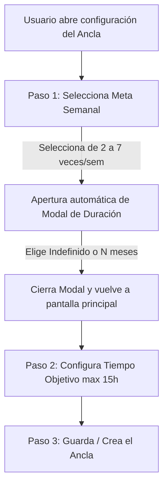

# Propuesta de Rediseño de Anclas: Metas, Duración de Compromiso y Flujo UX

Este documento detalla el plan técnico, las implicaciones del motor de scoring, la persistencia en base de datos y el flujo de interfaz de usuario (UX) para el refactor de la configuración de anclas en **Vocal**.

---

## 1. Mapeo en Base de Datos y Lógica Interna

Para almacenar el nuevo modelo lógico de anclas se usan campos explícitos en
`user_activity_configs` y se mantienen campos legacy como espejo mientras el
scoring actual termina de desacoplarse:

| Concepto de Negocio | Campo en `UserActivityConfigEntity` | Tipo de Dato | Reglas y Restricciones |
| --- | --- | --- | --- |
| **Meta Semanal** | `weeklyFrequencyTarget` | `Int` | Obligatorio. Entero entre `2` y `7` (ambos inclusive). |
| **Tiempo Objetivo** | `sessionTargetMinutes` | `Int` | Obligatorio. Entero entre `1` y `900` minutos. |
| **Duración del Compromiso** | `commitmentDurationMonths` | `Int?` | `null` representa **Indefinido** y es una configuracion valida. |
| **Cadencia** | `cadence` | `String` | Fijo a `"Weekly"`. |
| **Período** | `targetPeriod` | `String` | Fijo a `"Week"`. |
| **Espejo legacy de meta semanal** | `targetCount` | `Int` | Mismo valor que `weeklyFrequencyTarget`. |
| **Espejo legacy de tiempo** | `targetValue` | `Int` | Mismo valor que `sessionTargetMinutes`. |

### Implicación en el Scoring (`ScoreEngine.kt`)
El motor de scoring de la aplicación calcula el bonus de metas (`goalBonus`) buscando aquellas actividades configuradas con `isGoal() == true` y filtrando los logs correspondientes en base a su período.
* Al guardar la **Meta Semanal** en `weeklyFrequencyTarget` y espejarla en `targetCount` con `targetPeriod = "Week"` y `cadence = "Weekly"`, las nuevas anclas creadas se procesan como metas semanales dentro del motor de scoring actual.
* El soporte para períodos mensuales (`TargetPeriod.Month`) sigue existiendo en el enum y en `ScoreEngine.kt` para conservar la compatibilidad con el código heredado o para otras superficies, pero la UI de configuración de anclas ya no los generará.
* Las actividades de tipo **Ancla** que el usuario configure a partir de ahora tendrán por diseño una meta basada en semanas, promoviendo la consistencia diaria/semanal necesaria para construir la base personal de salud mental.

---

## 2. Flujo de Uso e Interacción UX

El flujo en la interfaz de usuario para agregar una nueva ancla o crear una personalizada responderá a tres preguntas clave de forma estructurada:

### Paso 1: Selección de la Meta Semanal
En la pantalla principal de configuración (`ActivityConfigSection` y `CreateCustomActivitySection`), el usuario ve una fila de botones rápidos:
* `2 veces/semana`, `3 veces/semana`, `4 veces/semana`, `5 veces/semana`, `6 veces/semana`, `7 veces/semana`.
* *(No se permite la opción de 1 vez/semana por diseño de consistencia).*
* Al hacer tap sobre cualquiera de estas opciones:
  1. Se actualiza la selección en pantalla.
  2. **Inmediatamente** se despliega el modal de duración del compromiso.

### Paso 2: Modal de Duración del Compromiso
El modal se superpone en pantalla y pregunta:
**"¿Cuántos meses quieres sostener esta ancla?"**

Opciones rápidas presentadas como chips o botones:
* **Indefinido** (preseleccionado por defecto).
* **3 meses**, **5 meses**, **7 meses**, **9 meses**, **11 meses**, **13 meses**.
* **Personalizado** (al seleccionarse, muestra un campo de texto numérico para ingresar la cantidad exacta de meses de compromiso).

Nota de ayuda debajo de las opciones:
> *Te recomendamos dejarlo como indefinido si esta ancla representa una base que aporta estabilidad a tu vida general.*

Al presionar **Aceptar**:
1. Se almacena el valor seleccionado (ej. `null` para indefinido, o el entero correspondiente de meses) en el estado mutable del formulario de Compose.
2. Se cierra el modal regresando el foco a la pantalla de configuración principal.

### Paso 3: Configuración de Tiempo Objetivo
El usuario puede ajustar la duración por sesión en horas y minutos utilizando el selector:
* El selector (`TimeWheelPicker`) permite configurar valores de horas desde `0` hasta `15` horas diarias (máximo 900 minutos).
* Si el usuario intenta sobrepasar las 15 horas, el valor se limita automáticamente a 15 horas.

### Paso 4: Confirmación y Guardado
* Al presionar el botón "Guardar ancla" o "Crear ancla", el ViewModel ejecuta `addActivityAsAnchor()` o `createActivity()` enviando la meta semanal (`weeklyFrequencyTarget`), el tiempo por sesión (`sessionTargetMinutes`) y la duración del compromiso (`commitmentDurationMonths`).
* Tras el guardado exitoso, la sección de "Mis anclas" en la lista de configuración se expande automáticamente y la tarjeta recién configurada realiza una transición de parpadeo/destello sutil para proporcionar retroalimentación visual al usuario.
